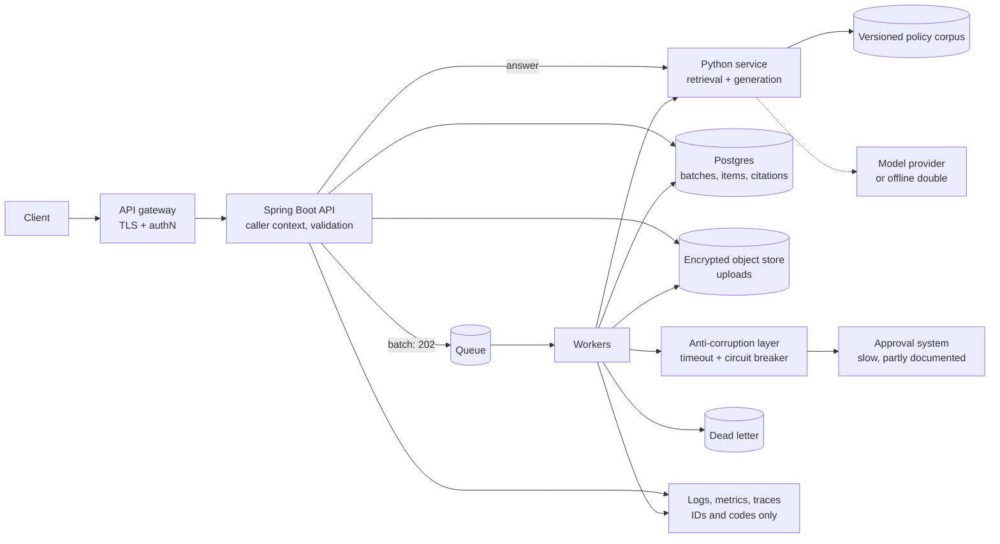

# Production design note

Scope: 10,000 requests/day containing personal information, with a slow,
partially documented approval system.

## First changes

1. **Make batch intake asynchronous.** `POST /batches` stores the files and returns `202` with a
   batch ID; workers process items from a queue and `GET /batches/{id}` returns progress and
   results. A synchronous multipart call cannot absorb a slow dependency or a month-end burst.
2. **Add durable state.** Postgres for batches, items, extracted fields, citations and issues;
   encrypted object storage for uploads. Idempotency keys on `(batch_id, document_id, file digest)`
   so retries and re-submissions converge on one result.
3. **Isolate the approval system behind an anti-corruption layer** with bounded timeouts, a circuit
   breaker, and retries only for calls confirmed idempotent. Because it is partially documented,
   unknown response shapes fail the item with a distinct code rather than being guessed at.
4. **Version the policy corpus.** Policies move into the database with effective intervals and an
   approval workflow; every answer stores the corpus version and chunk IDs used, so a past decision
   can be reproduced.

## Deployment

Containerised services on managed Kubernetes: one deployment per service plus workers, behind a
gateway terminating TLS and enforcing authentication. Scale workers on queue depth. Rolling deploys,
migrations gated in CI, secrets from a managed store.

## Main risks

- **Personal information.** Encrypt in transit and at rest, restrict access by role, redact PII from
  logs (we already log only IDs and codes), set retention and deletion timelines, keep an audit
  trail. Prompts must not leave the trust boundary unless the provider is contractually covered.
- **Tenant leakage.** Tenant and role stay server-derived from an authenticated token, with tenant
  filtering in the data layer and automated tests.
- **Prompt injection / over-trusted model output.** Status decisions stay in code; citations stay
  validated against eligible evidence.
- **Operational.** The slow approval system is the likely backlog source: per-dependency SLOs,
  dead-letter handling, alerts on queue age and failure rate, dashboards keyed by batch and
  document ID.

## What I would clarify first

Latency, availability and idempotency of the approval system; the authoritative source, change
cadence and approver of policy records; the precedence rule for contradictory policies (today we
refuse to invent one); data residency, retention and deletion rules; peak concurrency and file size
limits; whether a real model provider is in scope and approved for personal data.
