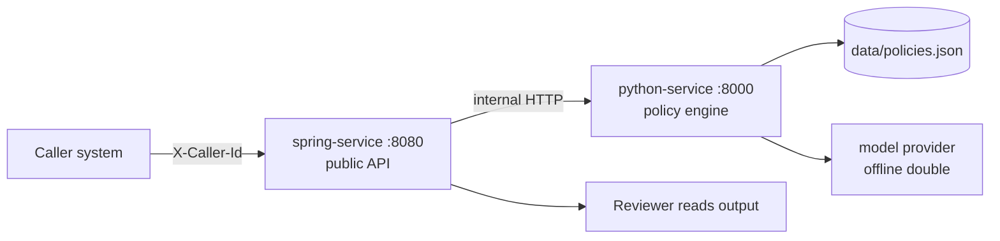
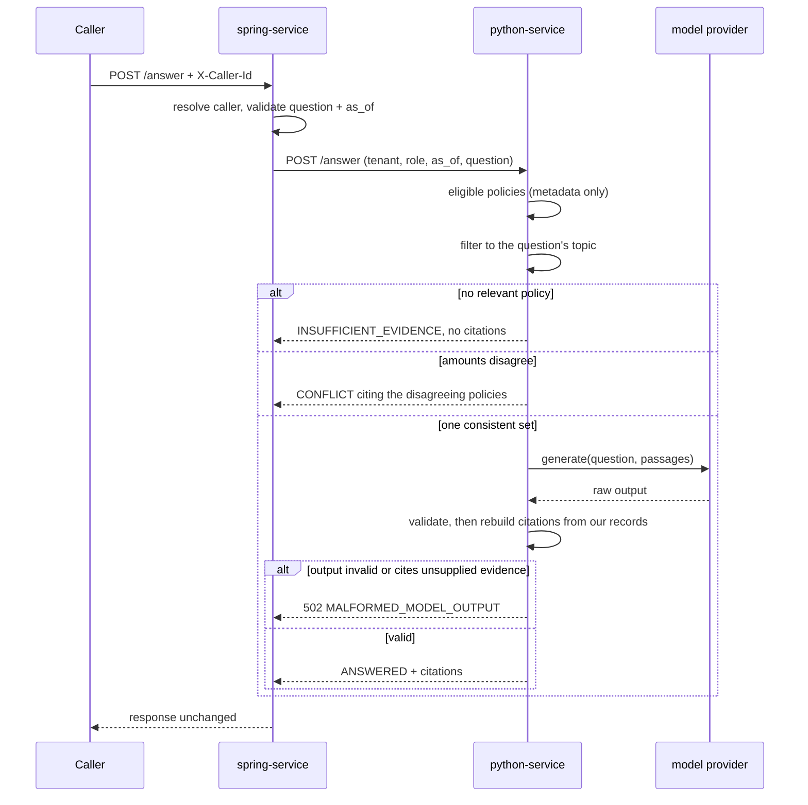
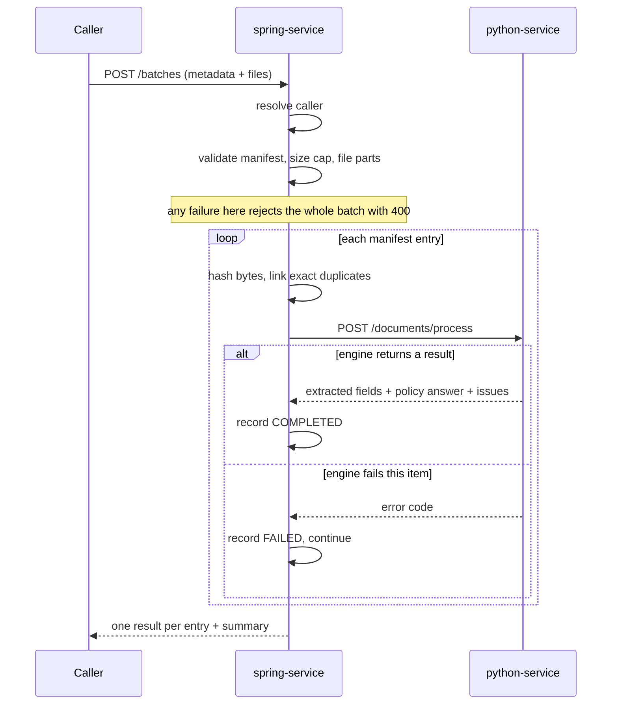
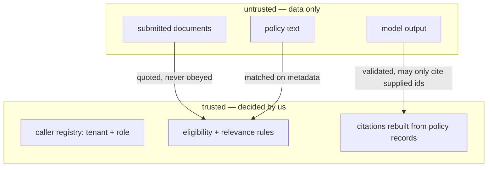

# 02 — High level design

Covers both services. Detail lives in [03-lld.md](03-lld.md).

## 1. Context

Only `spring-service` is public. `python-service` is reachable inside the trust boundary only.

## 2. Responsibility split

| concern | where | why there |
| --- | --- | --- |
| Caller → tenant + role | spring | identity must be decided once, at the edge |
| Request validity (question, date, manifest) | spring | reject bad requests before any work starts |
| Batch orchestration and item isolation | spring | it owns the batch contract and the failure boundary |
| Document text and field extraction | python | text handling lives with the text libraries |
| Eligibility, relevance, conflict | python | policy rules belong with the policy corpus |
| Answer generation and output validation | python | the model seam is here |
| HTTP error shaping | spring | one place produces the public error body |

**The rule that makes this work:** spring never interprets policy text; python never decides who
the caller is. Tenant and role arrive at python as parameters it trusts because spring derived them.

## 3. Key design decisions

| # | decision | rationale |
| --- | --- | --- |
| D-1 | **Status is decided by deterministic code; the model only phrases wording.** | `ANSWERED` / `INSUFFICIENT_EVIDENCE` / `CONFLICT` stay reproducible and testable. Swapping in a real LLM cannot change access decisions. |
| D-2 | **The model is called only after the evidence set is frozen.** | Ineligible and injection passages are filtered out before generation, so they cannot influence it. |
| D-3 | **Model output is validated and citations are rebuilt from our own records.** | A model cannot invent a quote or cite evidence it was not given. |
| D-4 | **Conflicts are reported, not resolved.** | No precedence rule was supplied. Inventing one would silently pick a winner. |
| D-5 | **Two services, synchronous HTTP.** | Matches the brief's scale. Async intake is the first production change (see PRODUCTION_DESIGN.md). |
| D-6 | **Offline deterministic model provider by default.** | Runs and tests with no API key; failure modes are selectable for demos. |

## 4. Answer flow

The model is never consulted for `INSUFFICIENT_EVIDENCE` or `CONFLICT`. Failed validation is
surfaced as an error, never downgraded to a lower-confidence answer.

## 5. Batch flow

## 6. Failure model

Three scopes, chosen so a caller can tell what to retry.

| scope | examples | result |
| --- | --- | --- |
| **Request** | unknown caller, blank question, bad date, bad manifest, batch too large | non-2xx, nothing processed |
| **Item** | empty file, unreadable PDF, oversized document, engine failure on that item | that item `FAILED`, others continue |
| **Neither** | missing amount, ambiguous amount, no applicable policy, injected text | `COMPLETED` with review reasons |

Dependency failures (`MODEL_TIMEOUT`, `ENGINE_UNAVAILABLE`, …) surface as non-2xx on `/answer` and
as item errors in a batch. They are never converted into `INSUFFICIENT_EVIDENCE`.

## 7. Trust boundary

Everything on the untrusted side can be quoted back to a human but can never change identity,
eligibility, or which evidence is cited.
